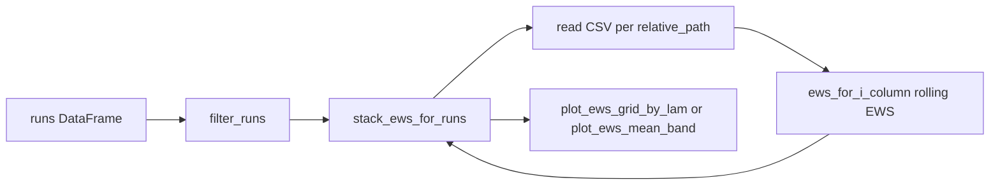

# Модуль `ews.py` — справочник

Кратко: **скользящие EWS-статистики** (mean, var, skew) по ряду заражённых `I` из CSV симуляций; **агрегация** по нескольким прогонам из таблицы `runs` (как `runs.csv`); **графики** mean по подвыборкам и mean ± std.

Исходник: [ews.py](../ews.py).

## Контракт данных

| Источник | Ожидаемые поля / содержимое |
|----------|-----------------------------|
| Таблица `runs` | Колонки `graph_kind`, `lam`, `relative_path` (путь к CSV относительно `data_root`) |
| CSV симуляции | Колонка `I` (и при необходимости другие имена, если передаёте `column` в `ews_for_i_column` / `iter_simulation_ews`) |

## Поток данных (обзор)

## Публичный API

Имена из `__all__` (строки 12–21 в `ews.py`).

### Скользящие метрики

#### `rolling_ews(series, window=10) -> pd.DataFrame`

- **Назначение:** по одномерному ряду — скользящие **mean**, **var** (ddof=0), **skew** (scipy, `bias=False`); окна только полной длины `window` (`min_periods=window`).
- **Возврат:** DataFrame с колонками `mean`, `var`, `skew`, индекс как у исходного ряда.
- [ews.py:25–40](../ews.py)

#### `ews_for_i_column(path, window=10, column="I") -> pd.DataFrame`

- **Назначение:** читает CSV с диска и применяет `rolling_ews` к колонке `column` (по умолчанию `I`).
- [ews.py:43–47](../ews.py)

### Фильтрация

#### `filter_runs(runs, graph_kind, lam_values=None) -> pd.DataFrame`

- **Назначение:** оставляет строки с `graph_kind == graph_kind`; если `lam_values` не `None` — ещё фильтр по `lam` (сравнение через `float`).
- **Возврат:** копия с `reset_index`.
- [ews.py:50–60](../ews.py)

### Агрегация по прогонам

#### `iter_simulation_ews(runs, data_root, window=10, column="I") -> Iterator[Tuple[pd.Series, pd.DataFrame]]`

- **Назначение:** по каждой строке `runs` — путь `data_root / relative_path`, EWS для выбранной колонки; **yield** `(row, ews_frame)`.
- [ews.py:87–96](../ews.py)

#### `stack_ews_for_runs(runs, data_root, window=10) -> np.ndarray`

- **Назначение:** укладывает EWS по всем run’ам в один массив.
- **Форма:** `(n_sim, T, 3)` — каналы: **mean, var, skew** по `I` (внутри вызывается `_stack_ews_optimized`, всегда колонка `I`).
- [ews.py:127–135](../ews.py)

#### `pointwise_mean_std(mat) -> (np.ndarray, np.ndarray)`

- **Назначение:** по оси 0 (симуляции) — `nanmean` и `nanstd` (ddof=0) для каждого момента времени.
- **Ожидаемая форма `mat`:** `(n_sim, T)`.
- [ews.py:99–103](../ews.py)

#### `mean_argmax_time_index(runs, data_root, column="I") -> float`

- **Назначение:** для каждого run — `argmax` по `column` в соответствующем CSV; возвращает **среднее** по run’ам индексов (день пика). Пустой `runs` → `nan`.
- [ews.py:70–84](../ews.py)

### Графики

#### `plot_ews_grid_by_lam(runs, data_root, window=10, graph_kind="barabasi_albert_graph", lam_values=None, figsize=None, show_mean_peak=True) -> plt.Figure`

- **Назначение:** сетка **3 × n_lam**: строки — mean / var / skew EWS; столбцы — уникальные `lam` после `filter_runs`. В каждой ячейке — **pointwise mean** EWS по всем τ/seed для данного `lam`.
- **Опции:** `show_mean_peak` — вертикальная пунктирная линия по `mean_argmax_time_index` для соответствующей подвыборки `part`.
- [ews.py:138–197](../ews.py)

#### `plot_ews_mean_band(runs, data_root, window=10, graph_kind="barabasi_albert_graph", lam_values=None, show_mean_peak=True) -> plt.Figure`

- **Назначение:** **одна** фигура, 3 ряда; по всем отфильтрованным run’ам сразу — **mean** и **заливка mean ± std** на каждом ряду. При `n_runs == 0` — заглушка с текстом.
- **Пик:** при `show_mean_peak` — одна вертикаль по среднему дню `argmax I` на всех `sub`.
- [ews.py:207–258](../ews.py)

## Вспомогательные сущности (не в `__all__`)

| Имя | Роль |
|-----|------|
| `_resolve_path(data_root, relative_path)` | Собирает абсолютный путь, проверяет существование файла; `FileNotFoundError` при отсутствии. [ews.py:63–67](../ews.py) |
| `_stack_ews_optimized(runs, data_root, window)` | Внутренняя реализация стека `(n_sim, T, 3)` для графиков. [ews.py:106–124](../ews.py) |
| `gfmt(x)` | Форматирование числа `lam` в заголовки (`int` без `.0` или `g`-формат). [ews.py:200–204](../ews.py) |

## Служебный / отладочный код

В конце файла: регион `# region agent log`, функция `_agent_log_ews_load()` и вызов при импорте. Пишет одну JSON-строку в `debug-e3ee3b.log` рядом с модулем (путь, сигнатура `plot_ews_grid_by_lam`). **Не** предметный API; при неиспользовании отладки блок можно удалить. [ews.py:261–293](../ews.py)

## Сводка: все определения функций в файле

| Функция | Публичная (`__all__`) |
|---------|------------------------|
| `rolling_ews` | да |
| `ews_for_i_column` | да |
| `filter_runs` | да |
| `_resolve_path` | нет |
| `mean_argmax_time_index` | да |
| `iter_simulation_ews` | да |
| `pointwise_mean_std` | да |
| `_stack_ews_optimized` | нет |
| `stack_ews_for_runs` | да |
| `plot_ews_grid_by_lam` | да |
| `gfmt` | нет |
| `plot_ews_mean_band` | да |
| `_agent_log_ews_load` | нет (отладка) |
